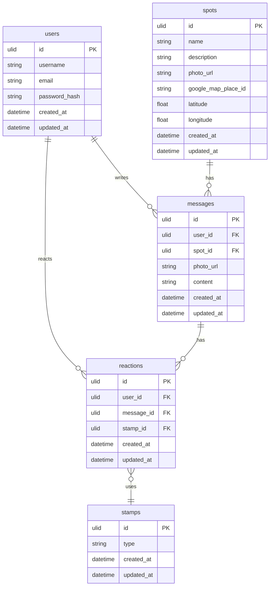

```mermaid
erDiagram
    users ||--o{ messages : "writes"
    users ||--o{ reactions : "reacts"
    messages ||--o{ reactions : "has"
    reactions }o--|| stamps : "uses"
    spots ||--o{ messages : "has"

    users {
        ulid id PK
        string username
        string email
        string password_hash
        datetime created_at
        datetime updated_at
    }
    
    spots {
        ulid id PK
        string name
        string description
        string photo_url
        string google_map_place_id
        float latitude
        float longitude
        datetime created_at
        datetime updated_at
    }

    messages {
        ulid id PK
        ulid user_id FK
        ulid spot_id FK
        string photo_url
        string content
        datetime created_at
        datetime updated_at
    }

    stamps {
        ulid id PK
        string type
        datetime created_at
        datetime updated_at
    }

    reactions {
        ulid id PK
        ulid user_id FK
        ulid message_id FK
        ulid stamp_id FK
        datetime created_at
        datetime updated_at
    }
```
