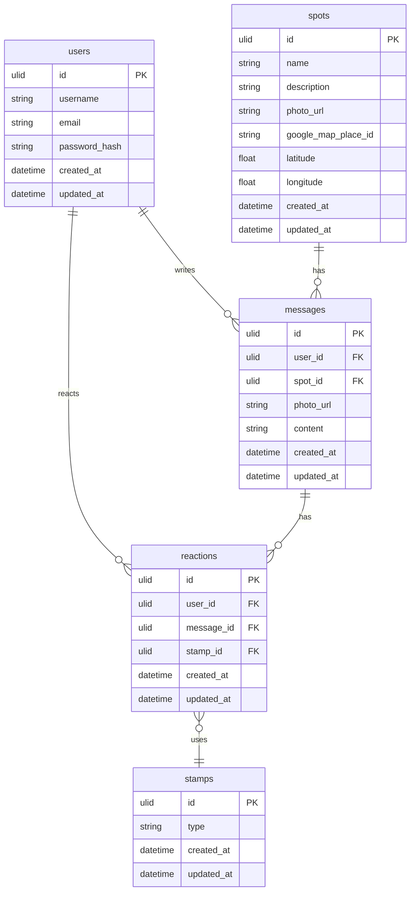

# つむぎ

## 製品概要

このプロダクトは、「場所に対する誰かの想いを形にし、その想いを共有し合う『エモいコミュニケーションアプリ」です。

## 背景(製品開発のきっかけ、課題等）

〜あなたにとって、想い出の場所はありますか？〜

昔通っていた小学校、友達と一緒に遊んだ公園、自分だけの隠れ家のようなカフェ。それぞれの場所には、私たちの心に深く刻まれた特別な瞬間が宿っています。そして、その一瞬一瞬は、誰かにとってかけがえのない宝物になるのです。

私たちは今、SNS の時代に生きています。確かに、これらは私たちを近づけてくれる一方で、広大なインターネットの海に身を投じ、身近な場所の美しさや大切さを見失ってしまうことがあります。地域社会が過疎化し、孤独感が深まる現代。そんな中で、私たちのアプリが提供する寄せ書きの体験が、心をつなぐ小さなきっかけとなることを願っています。

想い出の場所で、心の奥に秘めた感情を寄せ書きとして残すことで、地域への愛着が育まれ、孤独感が和らぎ、共感やつながりを感じる瞬間が生まれるでしょう。この小さな行動が、地域社会の再生や、あなた自身の心の豊かさにつながると信じています。

だから、もう一度、身近な場所での感動を感じてみませんか？その場所で、想い出を共にする誰かとつながることで、あなたの心に新たな温もりが生まれるはずです。

〜私たちと一緒に、その特別な瞬間を共有しましょう！〜

## 製品説明（具体的な製品の説明）

このアプリでは、下記のような機能を提供します。

### 1.近くのスポット表示機能

この機能で周囲の寄せ書きスポットを探し出すことができます。ユーザーは、自分が実際に訪れた想い出の場所を再確認し、新たなメッセージを追加することで、その場所への想いをさらに深めることもできます。また、他のユーザーが書き込んだ想い出を閲覧することで、そのスポットに隠されたストーリーや感情を感じ取ることができ、共感の輪が広がります!

### 2.その場所にいるときだけ寄せ書きを作成・閲覧できる機能

このアプリでは、ユーザーがスポットの近くにいるときのみ、寄せ書きを作成したり閲覧したりすることができます。この機能により、訪れた場所に込められた想いをその瞬間にシェアし、実際にその場にいた人たちと共感の輪を広げることができます。さらに、寄せ書きはその場所にいるユーザーだけが閲覧できるため、特別な想い出がより一層鮮明に心に刻まれます。
この仕組みが、訪れた場所での感情を深め、共通の想い出を持つ人々とのつながりを強化します！

### 3.リアクション機能

このアプリでは、寄せ書きに対してリアクションを送ることができます。ユーザーは他の人のメッセージに「いいね」や「共感」を表現することで、想い出や感情を共有し合うことが可能です。この機能は、寄せ書きの内容に対する感情の交流を促し、つながりをさらに深めます。また、リアクションを通じて、同じ場所にいた人たちの思いを確認し合うことで、より豊かなコミュニケーションが生まれます。これにより、実際にその場所で感じたことや経験が、他のユーザーと共鳴し合い、新たな理解や発見を生む手助けとなります！

## 製品画像

## デモ動画

### 特長

#### 特長1 思い出の再確認と共感の共有
ユーザーは、周囲の寄せ書きスポットを探し出し、自分が訪れた場所の思い出を再確認できます。また、他のユーザーが残したメッセージを通じて、その場所に隠されたストーリーや感情を感じ取り、共感の輪を広げることができます。これにより、場所と人々のつながりが深まります。

#### 特長2 場所限定の寄せ書き作成機能
ユーザーが特定のスポットにいるときのみ、寄せ書きを作成したり閲覧したりできる機能を提供します。この仕組みによって、訪れた場所での瞬間的な感情や思いをシェアし、実際にその場にいた人たちと特別なつながりを形成します。これにより、思い出がより鮮明に心に刻まれます。

#### 特長3　感情の交流を促すリアクション機能
ユーザーは他の人のメッセージに「いいね」や「共感」を送ることで、感情を共有し合うことができます。このリアクション機能は、寄せ書きの内容に対する感情の交流を促し、実際にその場所で感じたことや経験を他のユーザーと共鳴させ、新たな理解や発見を生む手助けとなります。

### 解決出来ること

### 今後の展望

### 注力したこと（こだわり等）

-
-

## 開発技術

### ER図

### 活用した技術

#### API・データ

- Google Maps API

#### フレームワーク・ライブラリ・モジュール

- Next.js 15
- Tailwind CSS
- Google Maps API
- Framer Motion
- aspida
- pnpm
- Gin
- GORM
- OpenAPI (Swagger)
- Cloud SQL (PostgreSQL)
- Cloud Run
- Artifact Registry
- GitHub Actions
- Docker
- Task / Makefile

#### デバイス

- Mobile(PWA)
- PC

### 力を入れた技術

- Google Map への独自開発ピン
- フロントエンドアニメーション
- PWA
- CI/CD

### 関連リンク
https://www.youtube.com/watch?v=G84fqAccqIA

