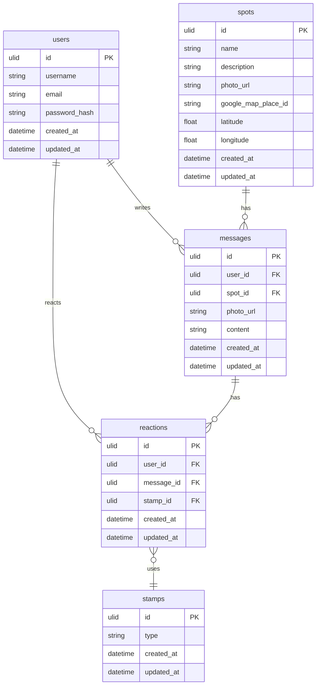

# つむぎ

## 製品概要

このプロダクトは、「場所に対する誰かの想いを形にし、その想いを共有し合う『エモいコミュニケーションアプリ」です。

## 背景(製品開発のきっかけ、課題等）

〜あなたにとって、想い出の場所はありますか？〜

昔通っていた小学校、友達と一緒に遊んだ公園、自分だけの隠れ家のようなカフェ。それぞれの場所には、私たちの心に深く刻まれた特別な瞬間が宿っています。そして、その一瞬一瞬は、誰かにとってかけがえのない宝物になるのです。

私たちは今、SNS の時代に生きています。確かに、これらは私たちを近づけてくれる一方で、広大なインターネットの海に身を投じ、身近な場所の美しさや大切さを見失ってしまうことがあります。地域社会が過疎化し、孤独感が深まる現代。そんな中で、私たちのアプリが提供する寄せ書きの体験が、心をつなぐ小さなきっかけとなることを願っています。

想い出の場所で、心の奥に秘めた感情を寄せ書きとして残すことで、地域への愛着が育まれ、孤独感が和らぎ、共感やつながりを感じる瞬間が生まれるでしょう。この小さな行動が、地域社会の再生や、あなた自身の心の豊かさにつながると信じています。

だから、もう一度、身近な場所での感動を感じてみませんか？その場所で、想い出を共にする誰かとつながることで、あなたの心に新たな温もりが生まれるはずです。

〜私たちと一緒に、その特別な瞬間を共有しましょう！〜

## 製品説明（具体的な製品の説明）

このアプリでは、下記のような機能を提供します。

### 1.近くのスポット表示機能

この機能で周囲の寄せ書きスポットを探し出すことができます。ユーザーは、自分が実際に訪れた想い出の場所を再確認し、新たなメッセージを追加することで、その場所への想いをさらに深めることもできます。また、他のユーザーが書き込んだ想い出を閲覧することで、そのスポットに隠されたストーリーや感情を感じ取ることができ、共感の輪が広がります!

### 2.その場所にいるときだけ寄せ書きを作成・閲覧できる機能

このアプリでは、ユーザーがスポットの近くにいるときのみ、寄せ書きを作成したり閲覧したりすることができます。この機能により、訪れた場所に込められた想いをその瞬間にシェアし、実際にその場にいた人たちと共感の輪を広げることができます。さらに、寄せ書きはその場所にいるユーザーだけが閲覧できるため、特別な想い出がより一層鮮明に心に刻まれます。
この仕組みが、訪れた場所での感情を深め、共通の想い出を持つ人々とのつながりを強化します！

### 3.リアクション機能

このアプリでは、寄せ書きに対してリアクションを送ることができます。ユーザーは他の人のメッセージに「いいね」や「共感」を表現することで、想い出や感情を共有し合うことが可能です。この機能は、寄せ書きの内容に対する感情の交流を促し、つながりをさらに深めます。また、リアクションを通じて、同じ場所にいた人たちの思いを確認し合うことで、より豊かなコミュニケーションが生まれます。これにより、実際にその場所で感じたことや経験が、他のユーザーと共鳴し合い、新たな理解や発見を生む手助けとなります！

## 製品画像

## デモ動画

## 特長

### 特長1 思い出の再確認と共感の共有
ユーザーは、周囲の寄せ書きスポットを探し出し、自分が訪れた場所の思い出を再確認できます。また、他のユーザーが残したメッセージを通じて、その場所に隠されたストーリーや感情を感じ取り、共感の輪を広げることができます。これにより、場所と人々のつながりが深まります。

### 特長2 場所限定の寄せ書き作成機能
ユーザーが特定のスポットにいるときのみ、寄せ書きを作成したり閲覧したりできる機能を提供します。この仕組みによって、訪れた場所での瞬間的な感情や思いをシェアし、実際にその場にいた人たちと特別なつながりを形成します。これにより、思い出がより鮮明に心に刻まれます。

### 特長3　感情の交流を促すリアクション機能
ユーザーは他の人のメッセージに「いいね」や「共感」を送ることで、感情を共有し合うことができます。このリアクション機能は、寄せ書きの内容に対する感情の交流を促し、実際にその場所で感じたことや経験を他のユーザーと共鳴させ、新たな理解や発見を生む手助けとなります。

## 解決出来ること
### 1. 孤独感の軽減
ユーザーは、特定の場所で他の人たちと共有する思い出や感情を通じて、孤独感を和らげることができます。
共感を得ることで、他者とのつながりを感じやすくなります。

### 2. 地域コミュニティの活性化
寄せ書きを通じて、地域の思い出やストーリーを共有することで、コミュニティのつながりが強化されます。
地域の魅力や文化を再発見し、訪れるきっかけにもなります。

### 3. 思い出の保存と共有
ユーザーは訪れた場所での思い出を寄せ書きとして保存し、新たに追加することで、その場所への想いを深められます。
他のユーザーが残したメッセージを閲覧することで、自分の経験と重ね合わせ、思い出をより豊かにすることができます。

### 4. リアルタイムの感情交流
特定のスポットにいるときのみ寄せ書きを作成・閲覧できるため、リアルタイムでの感情の共有が可能になります。
これにより、同じ場所にいるユーザー同士が、その瞬間の感情や思いを即座に交換し、より深い交流が生まれます。

### 5. 自己表現の機会提供
ユーザーが自身の思い出や感情を寄せ書きとして表現できることで、自己表現の場を提供します。
リアクション機能を通じて他者からの反応を得ることで、自分の思いが認められ、自己肯定感を高めることができます。

## 今後の展望
今後の展望として、下記のことを考えています。

### 1. コメントへの返信機能
各ユーザーが書いた寄せ書きに対し、コメントを通じてさらに会話が広がる機能を提供予定です。これにより、同じ場所に訪れたユーザー同士が交流し合い、より深い感情の共有が可能となります。また、他者との会話を通じて寄せ書きが生き生きとしたものになり、場所に込められたストーリーも多面的に彩られていきます。

### 2. タイムカプセル機能
指定した時間が経過した後にのみ開封できる寄せ書きを作成できるタイムカプセル機能の導入を検討しています。この機能により、未来の自分や誰かに向けたメッセージを残し、時間が経つとともにその場所への思い出が鮮やかに蘇るような仕組みを提供します。長い年月を経て、その場所での感情がどのように変わったかを再発見する楽しみも生まれます。

### 3. 歴史的な人物にゆかりのある場所マークの追加
歴史的な人物に縁のある場所に、特別なマークを追加します。これにより、ユーザーがその場所での寄せ書きをより興味深く感じ、過去の偉人や影響力のある人々の足跡を辿るきっかけを提供します。多くの人々にとって記憶に残る場所が、個人の寄せ書きを通じてさらなる価値を持ち、歴史や文化との深い結びつきが促進されます。

### 4. 有名人が訪れた場所マークの追加
人気のあるバンドや俳優などが訪れた場所には特別なマークを追加し、ファンがその場所に応援メッセージを残せる場として機能します。この機能を通じて、ファン同士が交流し、共通の思いを持つ人たちとのつながりが一層広がります。また、同じ場所で思いを共有することで、ファンコミュニティが自然に育まれ、ファンならではの熱い感情を分かち合える空間を提供します。ファンたちにとっても、特別な場所が増えることで、応援や共感の輪が広がり、さらに深いファン同士のつながりを生み出す場となると考えます。

### 5. 生成AIを活用した寄せ書き入力補助機能
生成AIを活用し、寄せ書きの作成をサポートする機能を追加予定です。ユーザーが伝えたい感情や思いを的確に表現できるように、適切な言葉の候補や文章の構成を提案し、文章作成の負担を軽減します。これにより、ユーザーは自身の気持ちをもっと表現しやすくなり、書き手の思いがより豊かに伝わる寄せ書きが生まれるでしょう。

これらの機能追加によって、さらに深く多様な感情の共有が可能になり、ユーザー同士や場所とのつながりを一層強めるプラットフォームとしての成長が期待できます。

## 注力したこと（こだわり等）

-  親しみやすいポップなデザイン
シンプルでポップなデザインにより、年齢や性別を問わず誰でも気軽に利用できるアプリを目指しています。明るく温かみのあるデザインで、ユーザーが安心して自分の思いを表現できる空間を提供し、寄せ書きやメッセージを通じたコミュニケーションが楽しめるように工夫しています。

-  寄せ書きとリアクションを活用した新しいコミュニケーションの創造
寄せ書きとリアクション機能を組み合わせ、これまでにない新しいコミュニケーションの形を提案します。寄せ書きを通じて特定の場所に思いを残し、他のユーザーがそれにリアクションすることで、場所にまつわる感情が多くの人に共有され、共感の輪が広がります。リアルなつながりを感じられるこの仕組みにより、ユーザー同士が場所や思い出を介して心のつながりを育んでいける空間を目指します。

-  クラウドを活用した即時性の高いスピード開発
クラウド技術を活用することで、ユーザーが投稿したメッセージやリアクションが即座に反映されるため、リアルタイムに近い感覚でコミュニケーションが可能です。このスピード感により、ユーザーに素早く価値を届け、常に新しい機能や改善を迅速に提供し続ける開発体制を実現しています。

## 開発技術

### ER図

## 活用した技術

### API・データ

- Google Maps API

### フレームワーク・ライブラリ・モジュール

- Next.js 15
- Tailwind CSS
- Google Maps API
- Framer Motion
- aspida
- pnpm
- Gin
- GORM
- OpenAPI (Swagger)
- Cloud SQL (PostgreSQL)
- Cloud Run
- Artifact Registry
- GitHub Actions
- Docker
- Task / Makefile

### デバイス

- Mobile(PWA)
- PC

### 力を入れた技術

- Google Map への独自開発ピン
- フロントエンドアニメーション
- PWA
- CI/CD

## 関連リンク
https://www.youtube.com/watch?v=G84fqAccqIA

